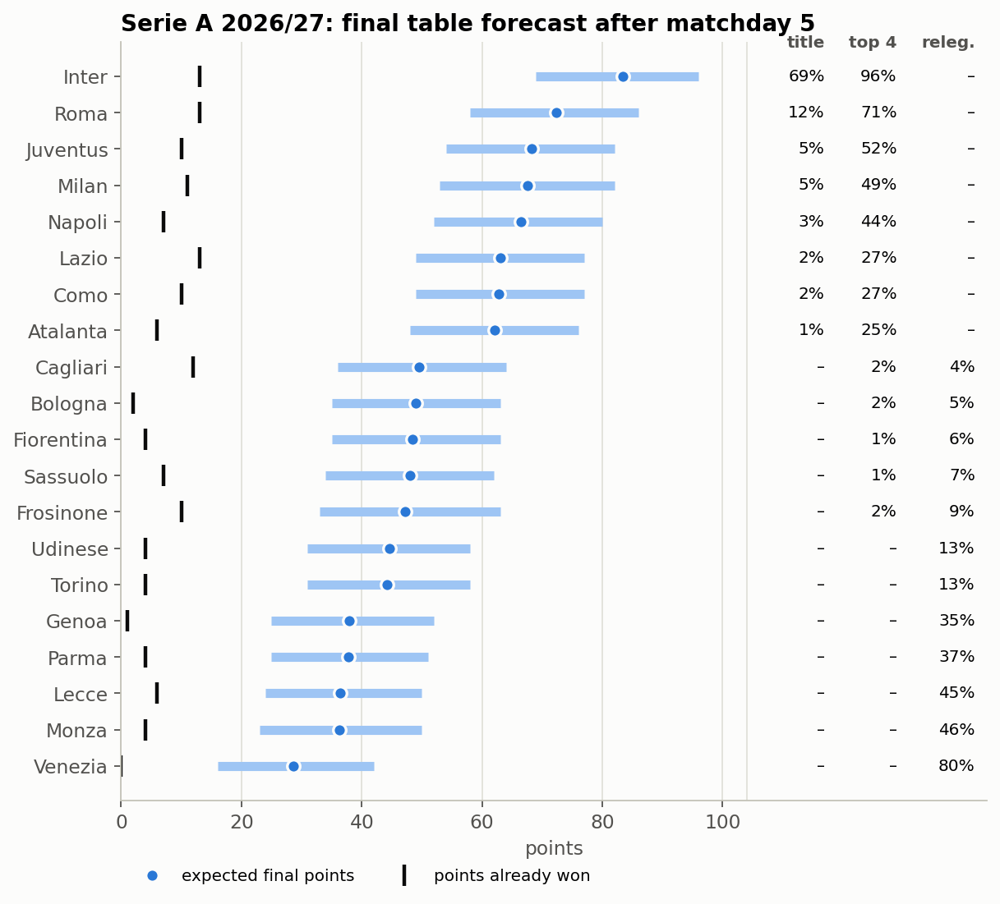
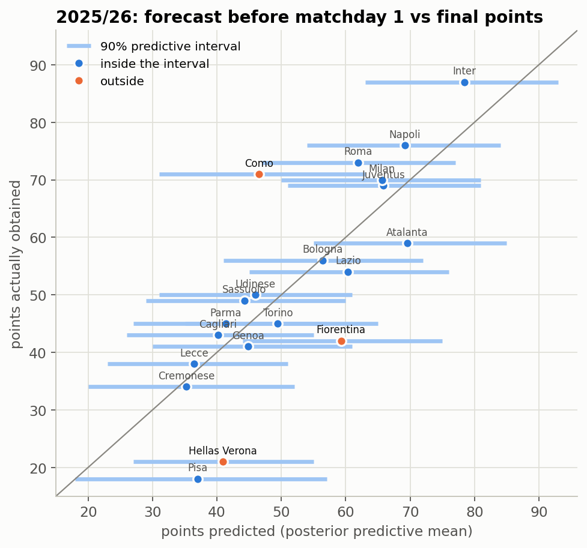
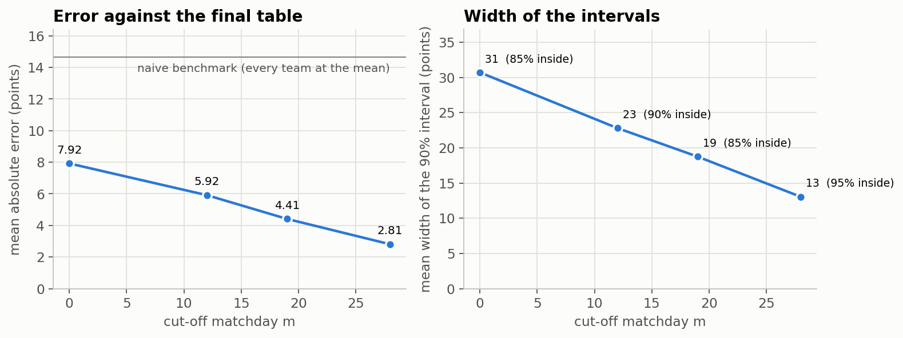
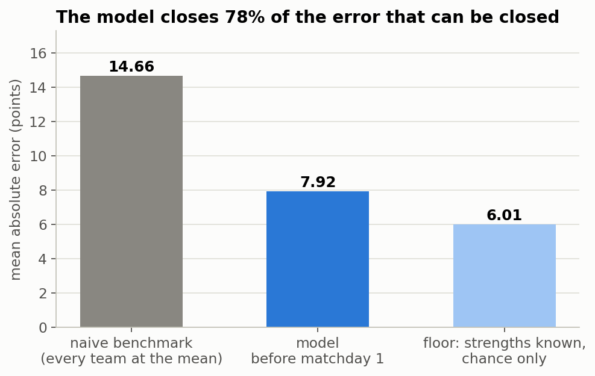
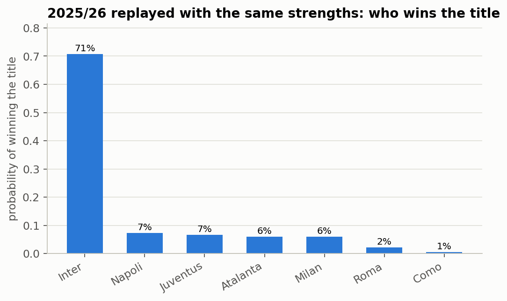
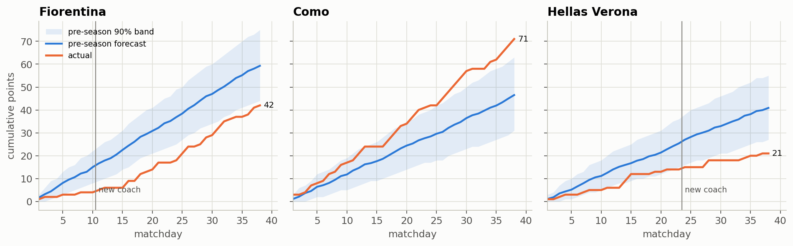
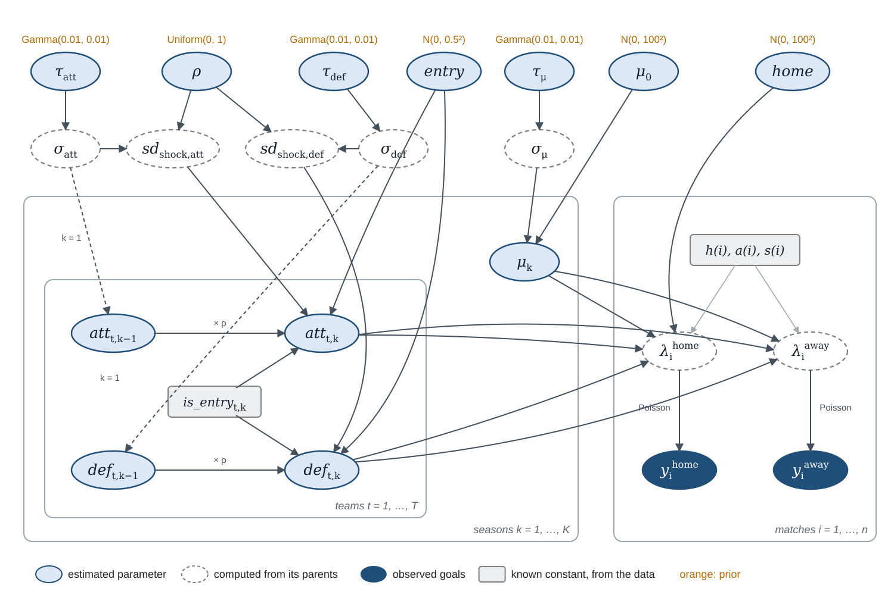

# Serie A Bayesian forecast

How much of a football league table can be known before the season starts?
This project forecasts the final Serie A table with a **dynamic hierarchical
Poisson model** (an extension of Baio & Blangiardo, 2010), checks it against a
complete season, and applies it to the season in progress.

- **Backtest on 2025/26:** forecasts made before matchday 1 and after matchdays 12, 19
  and 28, compared with the final table.
- **Forecast of 2026/27:** before matchday 1 and after the latest complete matchday,
  updated as the season goes on.
- **Live page:** [mb0mba.github.io/serie-a-bayesian-forecast](https://mb0mba.github.io/serie-a-bayesian-forecast/)

Built with Python, PyMC (NUTS), ArviZ, NumPy, pandas and matplotlib. It started as the
take-home project for *Applied Statistical Modelling* at the University of Bergamo,
written in R with nimble ([`r_original/`](r_original)), and was then rewritten in Python.

## Serie A 2026/27

<!-- forecast:start -->
**Forecast after matchday 5 (results up to 2026-09-21)** — 8,000 simulated seasons.

| # | Team | Points now | Expected points | 90% interval | Title | Top 4 | Relegation | Pre-season forecast |
|--:|:--|--:|--:|:-:|--:|--:|--:|--:|
| 1 | Inter | 13 | 83.4 | 69–96 | 69% | 96% | – | 79.6 |
| 2 | Roma | 13 | 72.3 | 58–86 | 12% | 71% | – | 64.1 |
| 3 | Juventus | 10 | 68.2 | 54–82 | 5% | 52% | – | 66.5 |
| 4 | Milan | 11 | 67.6 | 53–82 | 5% | 49% | – | 63.9 |
| 5 | Napoli | 7 | 66.5 | 52–80 | 3% | 44% | – | 67.2 |
| 6 | Lazio | 13 | 63.1 | 49–77 | 2% | 27% | – | 56.5 |
| 7 | Como | 10 | 62.8 | 49–77 | 2% | 27% | – | 59.8 |
| 8 | Atalanta | 6 | 62.1 | 48–76 | 1% | 25% | – | 65.3 |
| 9 | Cagliari | 12 | 49.5 | 36–64 | – | 2% | 4% | 41.4 |
| 10 | Bologna | 2 | 49.0 | 35–63 | – | 2% | 5% | 55.1 |
| 11 | Fiorentina | 4 | 48.5 | 35–63 | – | 1% | 6% | 53.8 |
| 12 | Sassuolo | 7 | 48.0 | 34–62 | – | 1% | 7% | 46.0 |
| 13 | Frosinone | 10 | 47.2 | 33–63 | – | 2% | 9% | 38.6 |
| 14 | Udinese | 4 | 44.6 | 31–58 | – | – | 13% | 46.7 |
| 15 | Torino | 4 | 44.2 | 31–58 | – | – | 13% | 46.0 |
| 16 | Genoa | 1 | 38.0 | 25–52 | – | – | 35% | 45.1 |
| 17 | Parma | 4 | 37.7 | 25–51 | – | – | 37% | 40.0 |
| 18 | Lecce | 6 | 36.4 | 24–50 | – | – | 45% | 36.5 |
| 19 | Monza | 4 | 36.3 | 23–50 | – | – | 46% | 38.1 |
| 20 | Venezia | 0 | 28.6 | 16–42 | – | – | 80% | 36.6 |
<!-- forecast:end -->



Probability of each final position: [figures/forecast_2026_27_positions.png](figures/forecast_2026_27_positions.png).

## Does it work? Backtest on 2025/26

The model is fitted on the five previous seasons only, plus the matchdays already
played, and refitted from scratch at every cut-off.

<!-- backtest:start -->
| Forecast made | Matches used | Matches simulated | Correlation | Mean abs. error | 90% interval width | Coverage |
|:--|--:|--:|--:|--:|--:|--:|
| before matchday 1 | 1900 | 380 | 0.817 | 7.92 | 30.7 | 0.85 |
| after matchday 12 | 2020 | 260 | 0.919 | 5.92 | 22.8 | 0.90 |
| after matchday 19 | 2090 | 190 | 0.953 | 4.41 | 18.8 | 0.85 |
| after matchday 28 | 2180 | 100 | 0.981 | 2.81 | 13.1 | 0.95 |

Naive benchmark (every team at the league average): **14.66** points. Error left by chance alone (strengths fixed at their after-matchday-28 estimates, season replayed 8,000 times): **6.01** points. The pre-season model closes **78%** of the gap that can be closed.
<!-- backtest:end -->





**Most of the remaining error is chance.** Fixing every team's strength at its best
estimate and replaying the season 8,000 times, a team's final points still vary by
about ±7.5 points: that is the error no model of this kind can remove. In the same
replays the strongest team does not always win the title.

<p float="left">
  
  
</p>

**The misses.** The teams that fell outside their pre-season interval changed a lot
over one summer, which a model built on persistence cannot anticipate; it follows
them once the matches reveal the change.



More: [every team at every cut-off](figures/backtest_every_team.png) ·
[team strengths before the season](figures/backtest_strengths.png) ·
[posterior of home, ρ and entry](figures/backtest_posteriors.png) ·
[goals vs Poisson](figures/poisson_fit.png)

## The model

For match *i*, played in season *s(i)* between home team *h(i)* and away team *a(i)*:

$$y_i^{\text{home}} \sim \text{Poisson}(\lambda_i^{\text{home}}), \qquad y_i^{\text{away}} \sim \text{Poisson}(\lambda_i^{\text{away}})$$

$$\log\lambda_i^{\text{home}} = \mu_{s(i)} + \text{home} + \text{att}_{h(i),s(i)} - \text{def}_{a(i),s(i)}$$

$$\log\lambda_i^{\text{away}} = \mu_{s(i)} + \text{att}_{a(i),s(i)} - \text{def}_{h(i),s(i)}$$

Attack and defence strengths change from season to season with a first-order autoregression,

$$\text{att}_{t,k} \sim \mathcal N\left(\rho\,\text{att}_{t,k-1} + \text{entry}\cdot E_{t,k},\ \sigma_{\text{att}}^2(1-\rho^2)\right), \qquad \text{att}_{t,1} \sim \mathcal N(0, \sigma^2_{\text{att}}),$$

and the same for def, where $E_{t,k} = 1$ in the first season team *t* appears in the data (`is_entry` in the code). Each season has its own scoring level $\mu_k \sim \mathcal N(\mu_0, \sigma^2_\mu)$.

| Index | Meaning |
|---|---|
| *i* | match |
| *t* | team (29 over the seven seasons) |
| *k* | season (*k* = 1 is 2020/21) |
| *h(i)*, *a(i)*, *s(i)* | home team, away team and season of match *i* |
| *m* | matchdays of the target season already played when forecasting |



| Parameter | Prior | Meaning |
|---|---|---|
| home | N(0, 100²) | home advantage, shared by all teams |
| μ₀ | N(0, 100²) | average scoring level |
| ρ | Uniform(0, 1) | how much of a team's distance from the average survives a summer |
| entry | N(0, 0.5²) | shift for a team appearing in the data for the first time |
| τ_att, τ_def, τ_μ | Gamma(0.01, 0.01) | precisions; σ = 1/√τ |

Choices worth knowing about:

- **The summer shock is not a free parameter.** Its standard deviation is
  σ·√(1−ρ²), the value that keeps the spread between teams the same in every season.
- **Differences from Baio & Blangiardo:** a scoring level per season instead of
  sum-to-zero constraints (which pin an average away side to exactly one expected goal),
  strengths that evolve across seasons, an entry effect for newly arrived teams, and a
  defence parameter with a minus sign so that higher is better for both. Their mixture
  model is not used: the autoregression already pulls each team towards its own past
  rather than towards the league average.
- **Fitting:** NUTS, 4 chains × 2,000 draws after 1,500 tuning steps. The strengths are
  written non-centred (`att = ρ·att_prev + entry·is_entry + sd_shock·z`, `z ~ N(0,1)`),
  the same distribution in a form NUTS explores more easily.
- **Forecasting:** every posterior draw plays the remaining matches once, drawing goals
  from the Poisson; points already won are added as they are. All 8,000 draws are used.
  Ties on points are broken by goal difference.

## Run it yourself (Linux or WSL)

```bash
git clone https://github.com/MB0mba/serie-a-bayesian-forecast.git
cd serie-a-bayesian-forecast
```

Then install the dependencies in an environment of your choice:

```bash
# with conda
conda create -n seriea python=3.11 -y && conda activate seriea
pip install -r requirements.txt

# or with venv (on Ubuntu/WSL this needs: sudo apt install python3-venv)
python3 -m venv .venv && source .venv/bin/activate
pip install -r requirements.txt
```

and run the steps:

```bash
python scripts/01_build_dataset.py     # download results -> data/seriea_2020_2027.csv
python scripts/02_backtest_2025_26.py  # 4 fits, ~20 min on 4 cores
python scripts/03_forecast_2026_27.py  # pre-season + latest matchday, ~10 min
python scripts/04_figures.py           # figures/
python scripts/05_report.py            # docs/index.html and the tables in this README
python scripts/make_dag.py             # figures/dag.svg
```

After each new matchday, `./update.sh` (with the environment active) runs the data,
forecast, figure and page steps and pushes the result (`./update.sh --no-push` to keep it local).

## Repository

```
seriea/            the package
  data.py          download and parse openfootball, build the data set
  model.py         the PyMC model
  simulate.py      posterior predictive simulation, accuracy, error floor
  pipeline.py      fit + simulate + save, for a list of cut-offs
  plots.py, page.py
scripts/           the steps above, in order
data/              seriea_2020_2027.csv (one row per match, 2020/21 – 2026/27)
results/2025-26/   backtest: forecasts, parameters, strengths, accuracy, error floor
results/2026-27/   current-season forecasts
figures/           all figures
docs/              the forecast web page (GitHub Pages)
r_original/        the original R / nimble version
```

## Data

Results come from [openfootball/italy](https://github.com/openfootball/italy), a
public-domain archive updated weekly. For 2020/21–2025/26 it was checked match by match
against FBref, the source of the original project: 2,280 matches, no difference in
goals or matchday (`python scripts/01_build_dataset.py --check other.csv` repeats the check).

## References

- Baio, G. and Blangiardo, M. (2010). Bayesian hierarchical model for the prediction of
  football results. *Journal of Applied Statistics*, 37(2), 253–264.
- Maher, M. J. (1982). Modelling association football scores. *Statistica Neerlandica*, 36(3), 109–118.
- Dixon, M. J. and Coles, S. G. (1997). Modelling association football scores and
  inefficiencies in the football betting market. *JRSS C*, 46(2), 265–280.
- Gelman, A. (2006). Prior distributions for variance parameters in hierarchical models.
  *Bayesian Analysis*, 1(3), 515–534.

## License

Code: MIT. Data: openfootball, public domain.
